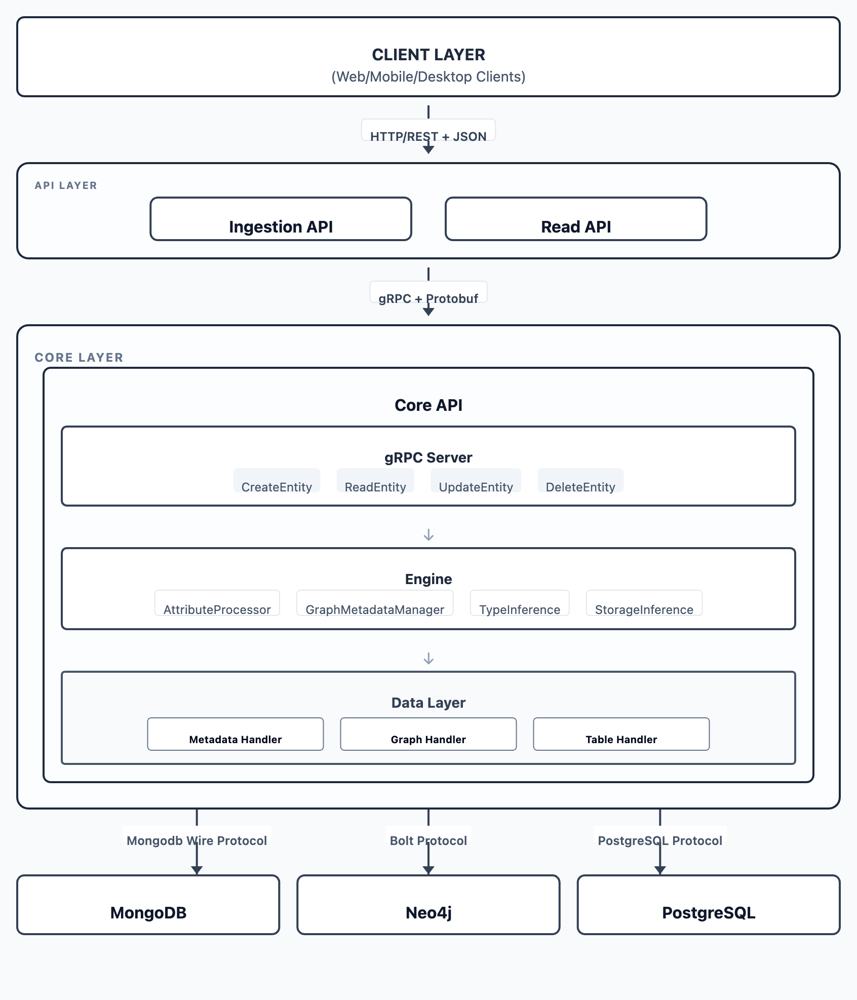

# OpenGIN Architecture Overview

## System Overview

**OpenGIN** is a data orchestration and networking framework. It is based on a polyglot database and a microservices-based design that handles entities with metadata, attributes, and relationships. The architecture follows a layered approach with REST/gRPC communication protocols.

---

## High-Level Architecture Diagram





---

## Architecture Layers

### 1. API Layer (Client-Facing Services)

#### Ingestion API
- **Purpose**: Handle entity mutations (CREATE, UPDATE, DELETE)
- **Technology**: Ballerina REST service
- **Location**: `opengin/ingestion-api/`
- **Responsibilities**:
  - Accept JSON payloads from clients
  - Validate request structure
  - Convert JSON to Protobuf Entity messages
  - Communicate with CORE Service via gRPC
  - Convert Protobuf responses back to JSON
- **Contract**: OpenAPI specification at `opengin/contracts/rest/ingestion_api.yaml`

#### Read API
- **Purpose**: Handle entity queries and retrieval
- **Technology**: Ballerina REST service
- **Location**: `opengin/read-api/`
- **Responsibilities**:
  - Accept read requests from clients
  - Support selective field retrieval (metadata, relationships, attributes)
  - Filter and search capabilities
  - Communicate with CORE Service via gRPC
  - Return formatted JSON responses
- **Contract**: OpenAPI specification at `opengin/contracts/rest/read_api.yaml`

### 2. Service Layer

#### Core API
Central orchestration service that manages data networking and all database interactions.

**Location**: `opengin/core-api/`

**Core Components**:

1. **gRPC Server** (`cmd/server/service.go`)
   - `CreateEntity(ctx, *pb.Entity) (*pb.Entity, error)`
     - Orchestrates entity creation across all databases
     - Saves metadata to MongoDB
     - Creates entity node in Neo4j
     - Handles relationships in Neo4j
     - Processes attributes for PostgreSQL
   
   - `ReadEntity(ctx, *pb.ReadEntityRequest) (*pb.Entity, error)`
     - Retrieves entity information from multiple databases
     - Supports selective field retrieval via output parameter
     - Assembles complete entity from distributed storage
   
   - `UpdateEntity(ctx, *pb.UpdateEntityRequest) (*pb.Entity, error)`
     - Updates entity information across databases
     - Handles partial updates
   
   - `DeleteEntity(ctx, *pb.EntityId) (*pb.Empty, error)`
     - Removes entity from all databases
     - Cascades deletion across MongoDB, Neo4j, and PostgreSQL

2. **Engine Layer** (`engine/`)
   - **AttributeProcessor** (`attribute_resolver.go`)
     - Processes entity attributes
     - Determines storage strategy
     - Handles time-based attribute values
     - Manages attribute schema evolution (partial support)
   
   - **GraphMetadataManager** (`graph_metadata_manager.go`)
     - Manages graph metadata
     - Handles relationship metadata
   
   - **Type Inference** (`pkg/typeinference/inference.go`)
     - Automatically detects data types
     - Supports: int, float, string, bool, null
     - Special types: date, time, datetime
   
   - **Storage Inference** (`pkg/storageinference/inference.go`)
     - Determines optimal storage type
     - Types: tabular, graph, list, map, scalar

3. **Repository Layer** (`db/repository/`)
   - **MongoRepository** (`mongo/mongodb_client.go`, `mongo/metadata_handler.go`)
     - Handles metadata storage and retrieval
     - Connection management
     - CORE operations for metadata
   
   - **Neo4jRepository** (`neo4j/neo4j_client.go`, `neo4j/graph_entity_handler.go`)
     - Manages entity nodes and relationships
     - Graph traversal operations
     - Cypher query execution
   
   - **PostgresRepository** (`postgres/postgres_client.go`, `postgres/data_handler.go`)
     - Handles attribute storage
     - Schema management
     - Time-series data operations

### 3. Database Layer

#### MongoDB (Port 27017)
- **Purpose**: Flexible metadata storage
- **Collections**: 
  - `metadata` - Production metadata
  - `metadata_test` - Test metadata
- **Data Model**: Document-based key-value pairs
- **Why MongoDB**: Schema-less structure ideal for dynamic metadata
- **Location**: `deployment/development/docker/mongodb/`

#### Neo4j (Port 7474 HTTP, 7687 Bolt)
- **Purpose**: Entity and relationship storage
- **Data Model**: 
  - **Nodes**: Entities with properties (id, kind_major, kind_minor, name, created, terminated)
  - **Relationships**: Directed edges with properties (id, name, startTime, endTime)
- **Why Neo4j**: Optimized for graph traversal and relationship queries
- **Location**: `deployment/development/docker/neo4j/`

#### PostgreSQL (Port 5432)
- **Purpose**: Time-based attribute storage
- **Schema**:
  - `attribute_schemas` - Attribute type definitions
  - `entity_attributes` - Entity-to-attribute mappings
  - `attr_*` - Dynamic tables for each attribute type
- **Why PostgreSQL**: ACID compliance, complex queries, time-series support
- **Location**: `deployment/development/docker/postgres/`

### 4. Supporting Services

#### Cleanup Service
- **Purpose**: Database cleanup for testing and maintenance
- **Technology**: Python
- **Trigger**: Docker Compose profile (`--profile cleanup`)
- **Operations**:
  - Clears PostgreSQL tables
  - Drops MongoDB collections
  - Removes Neo4j nodes and relationships
- **Usage**: `docker-compose --profile cleanup run --rm cleanup /app/cleanup.sh pre`

#### Backup/Restore Service
- **Purpose**: Data persistence and version management
- **Operations**:
  - Local backup creation for all databases
  - GitHub-based backup storage with versioning
  - Automated restore from GitHub releases
- **Scripts**: `deployment/development/init.sh`
- **Documentation**: See `docs/deployment/BACKUP_INTEGRATION.md`

---

## Data Model

### Entity Structure (Protobuf)

```protobuf
message Entity {
    string id = 1;                              // Unique identifier
    Kind kind = 2;                              // major/minor classification
    string created = 3;                         // Creation timestamp (ISO 8601)
    string terminated = 4;                      // Optional termination timestamp
    TimeBasedValue name = 5;                    // Entity name with temporal tracking
    map<string, google.protobuf.Any> metadata = 6;        // Flexible metadata
    map<string, TimeBasedValueList> attributes = 7;       // Time-based attributes
    map<string, Relationship> relationships = 8;          // Entity relationships
}

message Kind {
    string major = 1;                           // Primary classification
    string minor = 2;                           // Secondary classification
}

message TimeBasedValue {
    string startTime = 1;                       // Value valid from
    string endTime = 2;                         // Value valid until (empty = current)
    google.protobuf.Any value = 3;              // Actual value (any type)
}

message Relationship {
    string id = 1;                              // Relationship identifier
    string relatedEntityId = 2;                 // Target entity
    string name = 3;                            // Relationship type
    string startTime = 4;                       // Relationship valid from
    string endTime = 5;                         // Relationship valid until
    string direction = 6;                       // Relationship direction
}
```

### Storage Distribution Strategy

The entity data is strategically distributed across three databases:

**Example Entity:**
```json
{
  "id": "entity123",
  "kind": {"major": "Person", "minor": "Employee"},
  "name": "John Doe",
  "created": "2024-01-01T00:00:00Z",
  "metadata": {"department": "Engineering", "role": "Engineer"},
  "attributes": {
    "expenses": {
      "columns": ["type", "amount", "date", "category"],
      "rows": [
        ["Travel", 500, "2024-01-15", "Business"],
        ["Meals", 120, "2024-01-16", "Entertainment"],
        ["Equipment", 300, "2024-01-17", "Office"]
      ]
    }
  },
  "relationships": {"reports_to": "manager123"}
}
```

**Storage Distribution:**

```
┌──────────────────────────────────────────────────────────────┐
│ MongoDB - Metadata Storage                                   │
│ ┌──────────────────────────────────────────────────────────┐ │
│ │ Collection: metadata                                     │ │
│ │ {                                                        │ │
│ │   "_id": "entity123",                                    │ │
│ │   "metadata": {                                          │ │
│ │     "department": "Engineering",                         │ │
│ │     "role": "Engineer"                                   │ │
│ │   }                                                      │ │
│ │ }                                                        │ │
│ └──────────────────────────────────────────────────────────┘ │
└──────────────────────────────────────────────────────────────┘

┌──────────────────────────────────────────────────────────────┐
│ Neo4j - Entity & Relationship Storage                        │
│ ┌──────────────────────────────────────────────────────────┐ │
│ │ Node:                                                    │ │
│ │ (entity123:Entity {                                      │ │
│ │   id: "entity123",                                       │ │
│ │   kind_major: "Person",                                  │ │
│ │   kind_minor: "Employee",                                │ │
│ │   name: "John Doe",                                      │ │
│ │   created: "2024-01-01T00:00:00Z"                        │ │
│ │ })                                                       │ │
│ │                                                          │ │
│ │ Relationship:                                            │ │
│ │ (entity123)-[:REPORTS_TO {                               │ │
│ │   id: "rel123",                                          │ │
│ │   startTime: "2024-01-01T00:00:00Z"                      │ │
│ │ }]->(manager123)                                         │ │
│ └──────────────────────────────────────────────────────────┘ │
└──────────────────────────────────────────────────────────────┘

┌──────────────────────────────────────────────────────────────┐
│ PostgreSQL - Attribute Storage                               │
│ ┌──────────────────────────────────────────────────────────┐ │
│ │ Table: attribute_schemas                                 │ │
│ │   {kind_major: "Person", attr_name: "expenses",          │ │
│ │    data_type: "table", storage_type: "tabular"}          │ │
│ │                                                          │ │
│ │ Table: entity_attributes                                 │ │
│ │   {entity_id: "entity123", attr_name: "expenses"}        │ │
│ │                                                          │ │
│ │ Table: attr_expenses                                     │ │
│ │   {row_id: 1,                                            │ │
│ │    type: "Travel", amount: 500,                          │ │
│ │    date: "2024-01-15", category: "Business"}             │ │
│ │   {row_id: 2,                                            │ │
│ │    type: "Meals", amount: 120,                           │ │
│ │    date: "2024-01-16", category: "Entertainment"}        │ │
│ │   {row_id: 3,                                            │ │
│ │    type: "Equipment", amount: 300,                       │ │
│ │    date: "2024-01-17", category: "Office"}               │ │
│ └──────────────────────────────────────────────────────────┘ │
└──────────────────────────────────────────────────────────────┘
```

---

## Data Flow Sequences

### Create Entity Flow

```
┌────────┐         ┌───────────────┐      ┌──────────────┐         ┌──────────┐
│ Client │         │ Ingestion API │      │ Core API     │         │ Databases│
└───┬────┘         └─────┬─────────┘      └──────┬───────┘         └────┬─────┘
    │                    │                       │                      │
    │ POST /entities     │                       │                      │
    │ (JSON payload)     │                       │                      │
    ├───────────────────>│                       │                      │
    │                    │                       │                      │
    │                    │ JSON to Protobuf      │                      │
    │                    │ conversion            │                      │
    │                    │                       │                      │
    │                    │ gRPC: CreateEntity    │                      │
    │                    ├──────────────────────>│                      │
    │                    │                       │                      │
    │                    │                       │ Save metadata        │
    │                    │                       ├─────────────────────>│
    │                    │                       │      (MongoDB)       │
    │                    │                       │                      │
    │                    │                       │ Create entity node   │
    │                    │                       ├─────────────────────>│
    │                    │                       │      (Neo4j)         │
    │                    │                       │                      │
    │                    │                       │ Create relationships │
    │                    │                       ├─────────────────────>│
    │                    │                       │      (Neo4j)         │
    │                    │                       │                      │
    │                    │                       │ Save attributes      │
    │                    │                       ├─────────────────────>│
    │                    │                       │    (PostgreSQL)      │
    │                    │                       │                      │
    │                    │    Entity (Protobuf)  │                      │
    │                    │<──────────────────────┤                      │
    │                    │                       │                      │
    │                    │ Protobuf to JSON      │                      │
    │                    │ conversion            │                      │
    │                    │                       │                      │
    │   201 Created      │                       │                      │
    │   (JSON response)  │                       │                      │
    │<───────────────────┤                       │                      │
    │                    │                       │                      │
```

### Read Entity Flow

```
┌────────┐         ┌───────────┐          ┌──────────────┐         ┌──────────┐
│ Client │         │ Read API  │          │ Core API     │         │ Databases│
└───┬────┘         └─────┬─────┘          └──────┬───────┘         └────┬─────┘
    │                    │                       │                      │
    │ GET /entities/123  │                       │                      │
    │ ?output=metadata,  │                       │                      │
    │  relationships     │                       │                      │
    ├───────────────────>│                       │                      │
    │                    │                       │                      │
    │                    │ gRPC: ReadEntity      │                      │
    │                    ├──────────────────────>│                      │
    │                    │                       │                      │
    │                    │                       │ Get entity info      │
    │                    │                       ├─────────────────────>│
    │                    │                       │    (Neo4j - always)  │
    │                    │                       │                      │
    │                    │                       │ Get metadata         │
    │                    │                       ├─────────────────────>│
    │                    │                       │  (MongoDB - if req'd)│
    │                    │                       │                      │
    │                    │                       │ Get relationships    │
    │                    │                       ├─────────────────────>│
    │                    │                       │  (Neo4j - if req'd)  │
    │                    │                       │                      │
    │                    │                       │ Get attributes       │
    │                    │                       ├─────────────────────>│
    │                    │                       │ (PostgreSQL -        │
    │                    │                       │             if req'd)│
    │                    │                       │ Assemble entity      │
    │                    │                       │                      │
    │                    │    Entity (Protobuf)  │                      │
    │                    │<──────────────────────┤                      │
    │                    │                       │                      │
    │                    │ Protobuf to JSON      │                      │
    │                    │ conversion            │                      │
    │                    │                       │                      │
    │   200 OK           │                       │                      │
    │   (JSON response)  │                       │                      │
    │<───────────────────┤                       │                      │
    │                    │                       │                      │
```

---

## Type System

### Type Inference System

**Location**: `opengin/core-api/pkg/typeinference/`

**Primitive Types:**
- `int` - Whole numbers without decimal points
- `float` - Numbers with decimals or scientific notation
- `string` - Text data
- `bool` - True/false values
- `null` - Absence of value

**Special Types:**
- `date` - Calendar dates (YYYY-MM-DD, DD/MM/YYYY, etc.)
- `time` - Time of day (HH:MM:SS)
- `datetime` - Combined date and time with timezone (RFC3339)

**Type Inference Rules:**
1. Numbers with decimal points → `float`
2. Whole numbers → `int`
3. Text matching date patterns → `date`
4. Text matching time patterns → `time`
5. Text matching datetime patterns → `datetime`
6. Everything else → `string`

### Storage Type Inference

**Location**: `opengin/core-api/pkg/storageinference/`

**Storage Types:**
1. **Tabular** - Has `columns` and `rows` fields
   ```json
   {"columns": ["id", "name"], "rows": [[1, "John"], [2, "Jane"]]}
   ```

2. **Graph** - Has `nodes` and `edges` fields
   ```json
   {"nodes": [{"id": "n1"}], "edges": [{"source": "n1", "target": "n2"}]}
   ```

3. **List** - Has `items` array
   ```json
   {"items": [1, 2, 3, 4, 5]}
   ```

4. **Scalar** - Single field with primitive value
   ```json
   {"value": 42}
   ```

5. **Map** - Key-value pairs (default)
   ```json
   {"key1": "value1", "key2": "value2"}
   ```

---

## Communication Protocols

| Layer | Protocol | Format | Port |
|-------|----------|--------|------|
| Client ↔ Ingestion API | HTTP/REST | JSON | 8080 |
| Client ↔ Read API | HTTP/REST | JSON | 8081 |
| APIs ↔ Core API | gRPC | Protobuf | 50051 |
| Core API ↔ MongoDB | MongoDB Wire Protocol | BSON | 27017 |
| Core API ↔ Neo4j | Bolt Protocol | Cypher | 7687 |
| Core API ↔ PostgreSQL | PostgreSQL Wire Protocol | SQL | 5432 |

---

## Network Architecture

**Docker Network**: `ldf-network` (bridge network)
All services run within the same Docker network:
- Container-based service discovery
- Internal communication via container names
- Health checks ensure proper startup sequencing
- Volume persistence for data storage

**Exposed Ports:**
- `8080` - Ingestion API (external access)
- `8081` - Read API (external access)
- `50051` - Core API (can be internal only)
- `27017` - MongoDB (development access)
- `7474/7687` - Neo4j (development access)
- `5432` - PostgreSQL (development access)

---

## Deployment

### Containerization
- **Technology**: Docker + Docker Compose
- **Orchestration File**: `docker-compose.yml`
- **Network**: `ldf-network` (bridge)
- **Volumes**: Persistent storage for all databases

### Health Checks

All services include health check configurations:
- MongoDB: `mongo --eval "db.adminCommand('ping')"`
- Neo4j: HTTP endpoint check on port 7474
- PostgreSQL: `pg_isready`
- Core API: TCP check on port 50051
- Ingestion/Read APIs: TCP checks on respective ports

### Dependency Management

Services start in proper order using Docker Compose `depends_on`:

```
Databases (MongoDB, Neo4j, PostgreSQL)
  ↓
Core API (waits for all databases to be healthy)
  ↓
Ingestion & Read APIs (wait for Core API to be healthy)
```

### Docker Compose Profiles
- **Default**: Runs all core services
- **cleanup**: Database cleanup service (separate profile)

---

## Technology Stack

| Component | Technology | Language | Purpose |
|-----------|-----------|----------|---------|
| Ingestion API | Ballerina | Ballerina | REST API for mutations |
| Read API | Ballerina | Ballerina | REST API for queries |
| Core API | Go + gRPC | Go | Business logic orchestration |
| MongoDB | MongoDB 5.0+ | - | Metadata storage |
| Neo4j | Neo4j 5.x | - | Graph storage |
| PostgreSQL | PostgreSQL 14+ | - | Attribute storage |
| Protobuf | Protocol Buffers | - | Service communication |
| Docker | Docker + Compose | - | Containerization |
| Testing | Go test, Bal test, Python | Multiple | Unit & E2E tests |

---

## Key Features

### 1. Polyglot Database Strategy
- **Optimized Storage**: Each database serves its best use case
- **Data Separation**: Clear boundaries between metadata, entities, and attributes
- **Scalability**: Independent scaling of each database

### 2. Time-Based Data Support
- **Temporal Attributes**: Track attribute values over time
- **Temporal Relationships**: Time-bound entity relationships
- **Historical Queries**: Query data at specific points in time (activeAt parameter)

### 3. Type Inference
- **Automatic Detection**: No manual type specification required
- **Rich Type System**: Supports primitives and special types
- **Storage Optimization**: Determines optimal storage based on data structure

### 4. Schema Evolution (Not Fully Supported)
- **Dynamic Schemas**: PostgreSQL tables created on-demand
- **Attribute Flexibility**: New attributes don't require migrations
- **Kind-Based Organization**: Attributes organized by entity kind

### 5. Graph Relationships
- **Native Graph Storage**: Neo4j for optimal relationship queries
- **Bi-directional Support**: Forward and reverse relationship traversal
- **Relationship Properties**: Rich metadata on relationships

### 6. Backup & Restore
- **Polyglot Database Backup**: Coordinated backups across all databases
- **Version Management**: GitHub-based version control
- **One-Command Restore**: Simple restoration from any version

### 7. API Contract-First
- **OpenAPI Specifications**: APIs defined before implementation
- **Code Generation**: Service scaffolding from contracts
- **Documentation**: Swagger UI for interactive API docs

---

## Related Documentation

- [How It Works](data_flow.md) - Detailed data flow documentation
- [Data Types](../../reference/datatype.md) - Type inference system details
- [Storage Types](../../reference/storage.md) - Storage type inference details
- [Backup Integration](../../reference/operations/backup_integration.md) - Backup and restore guide
- [Core API](../architecture/core-api.md) - Core API documentation
- [Service APIs](./api-layer-details.md) - Service APIs documentation

---
